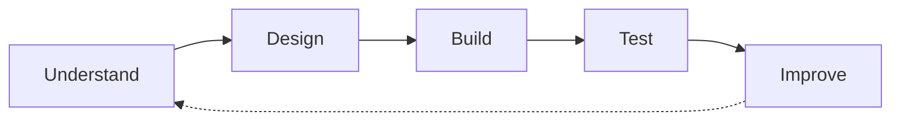

  

  

  <a href="#about">About</a> &nbsp;·&nbsp;
  <a href="#current-focus">Focus</a> &nbsp;·&nbsp;
  <a href="#featured-projects">Projects</a> &nbsp;·&nbsp;
  <a href="#technology">Technology</a> &nbsp;·&nbsp;
  <a href="#github-activity">Activity</a> &nbsp;·&nbsp;
  <a href="#connect">Connect</a>

 

## About

Hi, I'm **Aline**, a Software Engineer from Kigali, Rwanda.

I'm drawn to the moment a real-world problem becomes something that works: an API that responds, a database that holds up, an interface people can actually use, a system that learns from data.

 

> [!NOTE]
> **Education**
>
> Computer & Software Engineering at the University of Rwanda.

> [!TIP]
> **Right now**
>
> Apprentice at **AmaliTech** (2026 – present), building professional depth in Python backend engineering and AI application development.

> [!IMPORTANT]
> **Direction**
>
> Backend engineering and AI applications, while continuing to build full-stack products. My entrepreneurial projects taught me to ship; now I'm sharpening the engineering underneath them.

 

  
  
  
  

 

---

## Current Focus

I'm strengthening the foundations professional engineering rests on.

**Backend and architecture**
- Python backend engineering
- REST API development
- Databases and software architecture

**AI and intelligent systems**
- AI application development
- Machine learning

**Quality and reach**
- Software testing
- Full-stack development, so what I build works end to end

 

The engineer I'm working toward is one who can understand a problem, design a solution, build it, test it, and keep improving it.

---

## Featured Projects

### Kimelia Luxe

**AI-powered fashion commerce for African fashion.**

A product under Kimelia Soft exploring how AI, virtual try-on, and digital commerce can improve online fashion shopping while giving African fashion sellers better digital tools.

`React` `JavaScript` `Styled-Components` `AI` `Computer Vision`

[Live Demo](https://kimelia-lux.vercel.app/) &nbsp;·&nbsp; [Source Code](https://github.com/Aline-CROIRE/Kimelia-Luxe)

 

### Invento

**Intelligent inventory and business management.**

Inventory management, sales management, profit tracking, restocking insights, and business analytics in one place.

`React` `Node.js` `PostgreSQL` `AI`

[Live Demo](https://invento-rouge.vercel.app/) &nbsp;·&nbsp; [Source Code](https://github.com/Aline-CROIRE/Invento)

 

### FinCore Digital Banking

**A digital banking system exploring modern backend architecture.**

An exploration of financial workflows, authentication, distributed services, messaging, and backend architecture. This project sits closest to the direction I'm growing into.

`Java` `Spring Boot` `Microservices` `MongoDB` `RabbitMQ` `Docker` `React`

Source: see my [GitHub profile](https://github.com/Aline-CROIRE)

---

## Technology

The ecosystem I work with. Depth is currently being built around Python backend and AI application development.

| | |
|:--|:--|
| **Languages** | `Python` `Java` `JavaScript` `TypeScript` `Dart` `C` |
| **Backend** | `FastAPI` `Node.js` `Express` `Spring Boot` |
| **Frontend** | `React` `Next.js` `HTML5` `CSS3` |
| **Mobile** | `Flutter` `React Native` `Expo` `Firebase` |
| **Data & Infrastructure** | `PostgreSQL` `MongoDB` `Redis` `RabbitMQ` `Docker` `Nginx` `Linux` |
| **AI / ML** | `PyTorch` `TensorFlow` `OpenCV` `Hugging Face` |
| **Tools** | `Git` `GitHub` `VS Code` `Figma` |

---

## Selected Work

Earlier projects that shaped how I build.

- **[Procurement System API](https://github.com/Aline-CROIRE/Procurement-API)**: Backend API for procurement management with authentication, roles, business logic, and interactive documentation. `Node.js` `Express` `PostgreSQL` `Swagger` · [API Docs](https://procurement-backend-1.onrender.com/api-docs/)
- **[SelfGrowth App](https://github.com/Aline-CROIRE/SelfGrowth_App)**: Mobile app for personal growth, journaling, goals, authentication, and data persistence. `React Native` `Expo` `TypeScript`
- **[SectorFlow](https://github.com/Aline-CROIRE/SectorFlow)**: Business-sector selection interface that adapts the experience with conditional UI logic. `React` `Vite` `JavaScript` · [Live Demo](https://sector-flow.vercel.app/select-sector)
- **[Botiga](https://github.com/Aline-CROIRE/Botiga)**: E-commerce frontend focused on product discovery, categories, and search. `HTML` `CSS` `JavaScript` `React` · [Live Demo](https://botigashop2.netlify.app/)

---

## GitHub Activity

  
  &nbsp;
  

  

  

---

## What I Am Building Toward

Engineering depth in Python backends and AI-powered applications, applied to problems that matter in Rwanda and across Africa. I want to keep shipping real products, keep learning in public, and keep raising the standard of what I build.

---

## Connect

  
  
  
  

  

